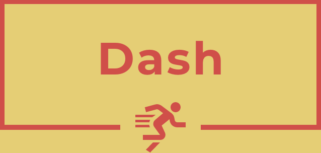
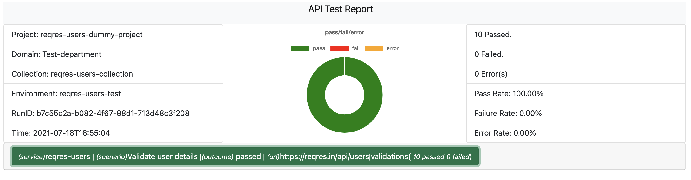

### Dash

#### Api test automation tool created with golang.

### Features
* Configure tests using yaml files
* Run a test case or test suite (organized in folders).
* Export results to json or csv for reporting.
* Specify numbers of test cases to replicate. (i.e how many duplicates of same test case.)
* Specify delay between tests. (e.g how much time to wait before making the next api call.)
* Soap payloads support.
* Initial functions to be executed e.g generate token for other api headers.
* Html reporting plugin for reporting.

### Installation
Download the source code, then compile for the intended architecture(unix,windows ...).
Place the generated binary and app`configs.yaml` file in the `bin` folder or `path` variables folder (WIN).

`go get https://github.com/derrick-gopher/dash`

or download sample builds from `builds` folder.

## Building
`go build -o dash`

### Running sample tests
Open commandline and type `dash`. If it was properly installed then the cli commands will be displayed.

On the project, sample scenarios and configurations are inside `test` folder.

`% dash -c test/configs.yaml -s test/test.yaml -v=true -o=all`

##### Options
- -c (string) config file
- -o (string) report output format, supported options are (json, csv, all)
- -s (string) scenarios directory/file
- -v (string) show a detailed log before writing to other formats

### Sample Report generated from json file

